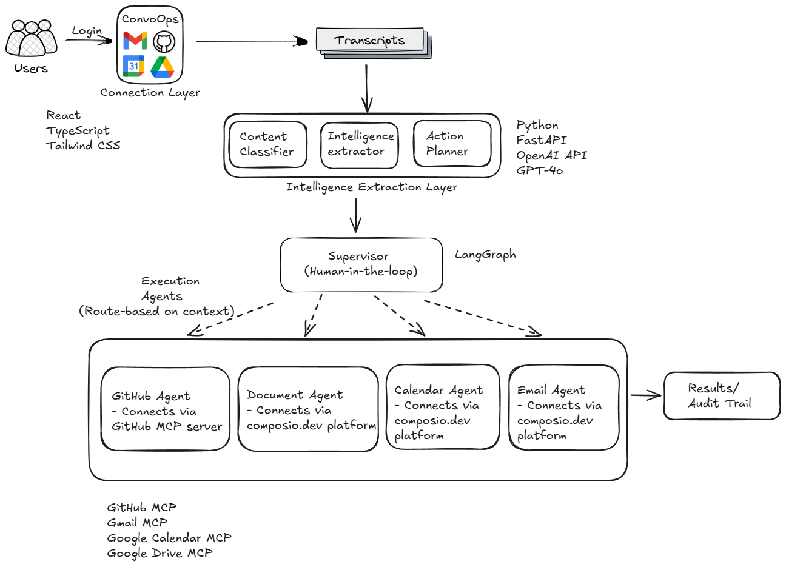

# ConvoOps

ConvoOps is an API-first, human-in-the-loop workflow agent that turns meeting transcripts into real execution.

Upload a transcript PDF, let the system extract intelligence and generate an action plan, review/approve actions, and execute them across tools like GitHub, Gmail, Google Calendar, and Google Drive.

## Why This Project

Teams lose momentum after meetings because decisions and next steps stay trapped in notes.
ConvoOps closes that gap:

- Extracts structured intelligence from conversation transcripts.
- Plans concrete, agent-routable actions.
- Requires human approval before execution.
- Executes approved actions with an audit trail.

## Core Features

- Transcript ingestion from PDF.
- Parallel intelligence layer (classification + extraction + planning).
- HITL (human-in-the-loop) approval gate.
- Multi-agent execution support:
	- GitHub issue creation
	- Gmail follow-up emails
	- Google Calendar meeting scheduling
	- Google Drive term-sheet document creation
- Incremental execution: additional actions can be approved after a run is already completed.
- End-to-end run tracking and audit endpoints.
- Frontend workspace with upload, approval, and results views.
- Demo onboarding flow with sign-in, sign-up, and permissions screens.

## Tech Stack

### Backend

- Python 3.10+
- FastAPI
- LangGraph + LangChain
- OpenAI models (`gpt-4o`, `gpt-4o-mini`)
- Pydantic
- MCP integrations via `langchain-mcp-adapters`
- `pdfplumber` for transcript parsing

### Frontend

- React 18 + TypeScript
- Vite
- Tailwind CSS
- Axios
- React Router
- React Markdown + remark-gfm

## Architecture



### Graph Details

- Graph builder: `backend/app/graph/builder.py`
- State schema: `backend/app/graph/state.py`
- HITL supervisor node: `backend/app/graph/nodes/supervisor.py`
- Planner node (action schema + agent routing): `backend/app/graph/nodes/planner.py`

## Repository Structure

```text
convo-ops/
	backend/
		app/
			api/
			graph/
		requirements.txt
	frontend/
		src/
			components/
		package.json
	README.md
```

<!-- ## Local Setup

### 1. Clone

```bash
git clone <your-repo-url>
cd convo-ops
```

### 2. Backend Setup

```bash
cd backend
python -m venv .venv
```

Windows PowerShell:

```powershell
.\.venv\Scripts\Activate.ps1
```

macOS/Linux:

```bash
source .venv/bin/activate
```

Install dependencies:

```bash
pip install -r requirements.txt
```

Create env file:

```bash
cp .env.example .env
```

Run backend:

```bash
uvicorn app.main:app --reload
```

Backend runs at `http://localhost:8000`.

### 3. Frontend Setup

In a new terminal:

```bash
cd frontend
npm install
npm run dev
```

Frontend runs at `http://localhost:5173`.

Vite is configured to proxy `/api` to `http://localhost:8000`.

## Environment Variables

Use `backend/.env.example` as reference. Main groups:

- OpenAI
	- `OPENAI_API_KEY`
	- `OPENAI_MODEL`
	- `OPENAI_FAST_MODEL`
- GitHub issue workflow
	- `GITHUB_TOKEN`
	- `GITHUB_REPO`
- Gmail MCP
	- Transport + stdio/remote config
- Google Drive MCP
	- Transport + stdio/remote config
- Google Calendar MCP
	- Transport + stdio/remote config

Each MCP integration supports transports: `stdio`, `streamable_http`, `sse`.

## API Endpoints

Base path: `/api/v1`

- `POST /runs`
	- Upload PDF and start run.
	- Returns `pending_approval` payload when graph pauses at supervisor.
- `GET /runs/{run_id}`
	- Get current run status and state snapshot.
- `POST /runs/{run_id}/approve`
	- Resume graph with `approved_actions`.
	- Also supports incremental execution even after completion.
- `GET /runs/{run_id}/audit`
	- Return full audit trail.

## Frontend Flow

Routes:

- `/signin`
- `/signup`
- `/permissions`
- `/app`

Workspace tabs inside `/app`:

- Upload Transcript
- Action Plan
- Results

Important UX behavior:

- Results are not auto-opened; user explicitly clicks to view results.
- Approval view supports action editing before execution.
- Agent-specific validation exists for email, meeting, and term-sheet actions.

## Current Action Types

Planner can produce these agent actions:

- `github_issue`
- `email`
- `meeting`
- `term_sheet`
- `slack` (currently stubbed)

## Demo Script (Quick)

1. Start backend + frontend.
2. Open app and go through sign-in and permissions screens.
3. Upload a transcript PDF.
4. Review generated action plan.
5. Approve selected actions.
6. Show grouped results and audit trail.

## Known Limitations

- In-memory checkpointer means run state is not persisted across backend restarts.
- Sign-in/permissions screens are mock UI for demo flow (not production auth).
- Slack action exists in planning taxonomy but is not fully implemented as an executor.

## Security Notes

- Never commit `.env` with real keys.
- Rotate any keys/tokens that were exposed during local testing or demos. -->
